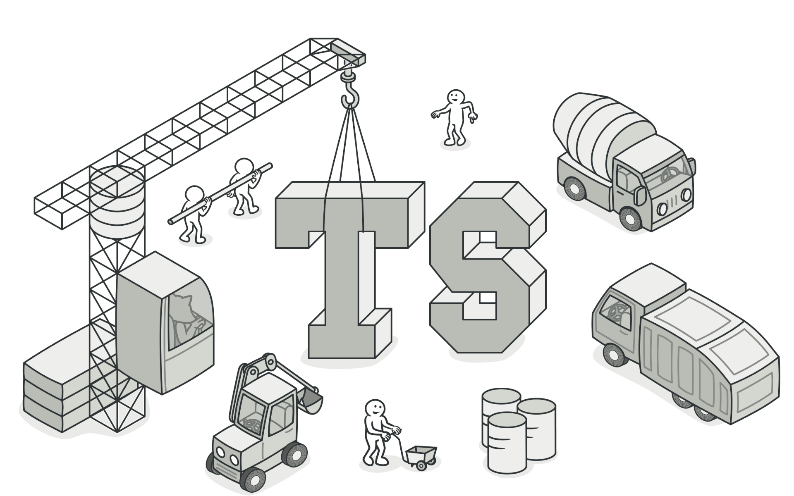
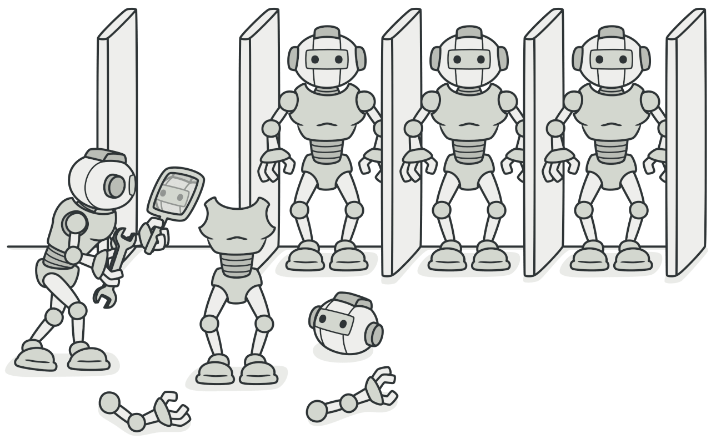

# Design Pattern for TypeScript 

Reference: https://refactoring.guru/design-patterns/typescript

# The Catalog of TypeScript

## Group 1: Creational Patterns

### Pattern 01 - Abstract Factory

Lets you produce families of related objects without specifying their concrete classes.

### Pattern 02 -Builder

Lets you construct complex objects step by step. The pattern allows you to produce different types and representations of an object using the same construction code. 

### Pattern 03 - Factory Method

Provides an interface for creating objects in a superclass, but allows subclasses to alter the type of objects that will be created.
### Pattern 04 - Prototype
 
Lets you copy existing objects without making your code dependent on their classes.

### Pattern 05 - Singleton

Lets you ensure that a class has only one instance, while providing a global access point to this instance.

## Group 2: Structural Patterns

### Pattern 1 - Adapter
### Pattern 2 - Bridge
### Pattern 3 - Composite
### Pattern 4 - Decorator
### Pattern 5 - Facade
### Pattern 6 - Flyweight
### Pattern 7 - Proxy

## Group 3: Behavioral Patterns

### Pattern 1 - Chain of Responsibility
### Pattern 2 - Iterator
### Pattern 3 - Memento
### Pattern 4 - State
### Pattern 5 - Template Method
### Pattern 6 - Command
### Pattern 7 - Mediator
### Pattern 8 - Observer
### Pattern 9 - Strategy
### Pattern 10 - Visitor

